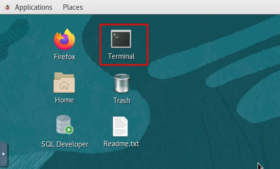
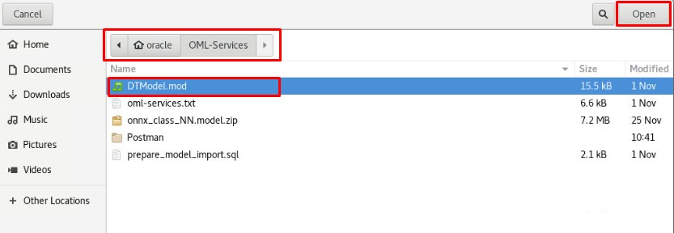

# Loading an OML  model and score it using Rest Services

In this section of the workshop we will import the Decision Tree model used on the OML4PY workshop Step 3 in our Autonomous Database and score it using REST APIs

Estimated Time: 20 minutes

### Objectives
We are going to run the next steps:
* Extract the saved model to a file;
* Load the model in the Autonomous Database repository;
* Deploy the model;
* Score a customer using the Decision Tree model;


### Prerequisites
* Run the OML4PY workshop. (Optional)
* Autonomous Database created
* OML user created in Autonomous database


##Import the Decision Tree model (optional)


## Task 1: Extract the saved model to a file

* Connect to the VM and open a Terminal window.

  

* Run these commands one by one:

````
. setEnv

. oraenv

ORACLE_SID = [mlcdb] ? - Hit Enter
````

  

* Go to the OML_Services folder.

````
$<copy> cd ~/OML-Services</copy>
````

  


* Run the `prepare_model_import.sql` script to write the exported DT_MODEL to a file on the operating system.

````
$ <copy> sqlplus sys/MLlearnPTS#21_@localhost:1521/mlpdb1.sub07141037280.rehevcn.oraclevcn.com as sysdba @prepare_model_import.sql</copy>
````

The script runs the following steps.

  

  - Creates the **`dmuser`** OS folder
  - Creates the **`DMDIR`** database directory
  - Creates a procedure that writes a BLOB to a file
  - Writes the saved Decision Tree model to a file named **`DTModel.mod`**

  Now we have the model saved in a file, the next steps are to load the model in Autonomous Database, deploy it there and score a customer.

To check the exported file run the command:

````
$<copy>ls ~/dmuser</copy>
````

  


## Task: 2: Load the model in the Autonomous Database repository

*  In the Postman session opened at Task 4 run the following Get method to get the list of models deployed.

````
Operation: GET

URI endpoint:
<copy>https://adb.<region-prefix>.oraclecloud.com/omlmod/v1/models </copy>

````
 - Replace **`<region-prefix>`** with your region. In our case: _eu-frankfurt-1_.

 In the Authorization tab pick **Bearer Token** and paste the token copied from Task 4.

 

The response is just the **SVMG** model we used in our previous tasks.

  

In case you get the Expired Token Error, rerun the generate Token command explained in **Task 4.1**.

* Open a new tab in Postman and run the following POST command to load the model in Autonomous Database.

````
Operation: POST

URI endpoint:
<copy>https://adb.<region-prefix>.oraclecloud.com/omlmod/v1/models </copy>

````
 - Replace **`<region-prefix>`** with your region. In our case: _eu-frankfurt-1_.

 In the Authorization tab pick **Bearer Token** and the token is pre-filled.

 

In the Headers tab enter the following:

````
Content-Type: application/json
boundary: Boundary
````

  


In the Body tab pick form-data and enter `modelData` in the key field, hover over the right side of the field and pick File in the dropdown.

  

Click Select File; go to `/home/oracle/dmuser/` folder and select the **`DTModel.mod`** file created earlier.

  

Add the next keys in the Body tab and click Send.

````
 modelName=DTModel
 modelType=OML
 version=1.0
````
  

The response is that the model is created.

 

Copy the **`modelId`** displayed in the JSON response.


## Task: 3: Deploy the model

* Open a new tab in Postman and run the following POST command to deploy the model in Autonomous Database.

````
Operation: POST

URI endpoint:
<copy>https://adb.<region-prefix>.oraclecloud.com/omlmod/v1/deployment </copy>

````
  - Replace **`<region-prefix>`** with your region. In our case: _eu-frankfurt-1_.

In the Authorization tab pick **Bearer Token** and the token is pre-filled.

    

In the Headers tab enter the following:

````
Content-Type: application/json
````

  

 In the Body tab enter the following JSON:

````
 {
   "uri":"dtmodel",
   "modelId":"50ffc903-aaf6-4a94-a228-4cb7ab6b3c07"
}
````

Where `50ffc903-aaf6-4a94-a228-4cb7ab6b3c07` is the model Id copied from the previous step. Replace it with the returned model Id from your command in Task 6.2.

The URI **`dtmodel`** we are going to use in the Task 6.4 when scoring the data against our model.

  

And the result is:

 

The next step is to score a customer.


## Task: 4: Score a customer using the Decision Tree model

In this step we are going to score Fran Hobbs against our Decision Tree imported model.

Enter the following details:

````
Operation: POST

URI endpoint:
<copy>https://adb.<region-prefix>.oraclecloud.com/omlmod/v1/deployment/<model_URI>/score </copy>

````
 - Replace **`<region-prefix>`** with your region. In our case: _eu-frankfurt-1_.

 - Replace **`<model_URI>`** with the model URI that we defined in previous task: **`dtmodel`**

In the Authorization tab pick **Bearer Token** and the token is pre-filled.

   


In the header Tab enter the details:

````
--header 'Content-Type: application/json'

````

    


In the Body tab enter the Fran Hobs data in RAW format. Notice that we are not providing any of the ``LTV`` or ``LTV_BIN`` data, but provide fully the other important data

````
<copy>
{
   "inputRecords":[
      {
         "CUST_ID":"CU12350",
         "LAST":"FRAN",
         "FIRST":"HOBBS",
         "STATE":"NV",
         "REGION":"Southwest",
         "SEX":"F",
         "PROFESSION":"Programmer/Developer",
         "BUY_INSURANCE":"No",
         "AGE":21,
         "HAS_CHILDREN":0,
         "SALARY":66180,
         "N_OF_DEPENDENTS":5,
         "CAR_OWNERSHIP":1,
         "HOUSE_OWNERSHIP":0,
         "TIME_AS_CUSTOMER":5,
         "MARITAL_STATUS":"SINGLE",
         "CREDIT_BALANCE":0,
         "BANK_FUNDS":500,
         "CHECKING_AMOUNT":185,
         "MONEY_MONTLY_OVERDRAWN":53.21,
         "T_AMOUNT_AUTOM_PAYMENTS":197,
         "MONTHLY_CHECKS_WRITTEN":4,
         "MORTGAGE_AMOUNT":0,
         "N_TRANS_ATM":3,
         "N_MORTGAGES":0,
         "N_TRANS_TELLER":2,
         "CREDIT_CARD_LIMITS":2500,
         "N_TRANS_KIOSK":4,
         "N_TRANS_WEB_BANK":0
      }
   ]
}
</copy>
````

Click Send

    

Notice the response for this scoring.

    

In this case the percentages are different but it still has the highest probability to be in the **LOW** category as it was in our Support Vector Machine Gaussian model.

In this exercise we managed took a model exported in the Python workshop and imported, deployed and scored it in Autonomous Database using the REST API interface.

## Acknowledgements
* **Authors** -  Andrei Manoliu, Milton Wan
* **Contributors** - Rajeev Rumale
* **Last Updated By/Date** -  Andrei Manoliu, October 2021

## Need Help?
Please submit feedback or ask for help using our [LiveLabs Support Forum](https://community.oracle.com/tech/developers/categories/livelabsdiscussions). Please click the **Log In** button and login using your Oracle Account. Click the **Ask A Question** button to the left to start a *New Discussion* or *Ask a Question*.  Please include your workshop name and lab name.  You can also include screenshots and attach files.  Engage directly with the author of the workshop.

If you do not have an Oracle Account, click [here](https://profile.oracle.com/myprofile/account/create-account.jspx) to create one.
