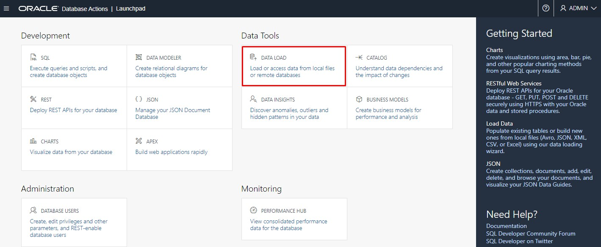
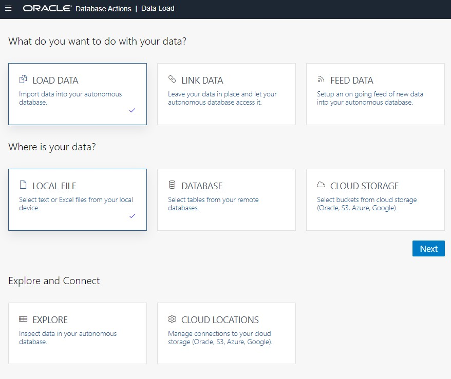
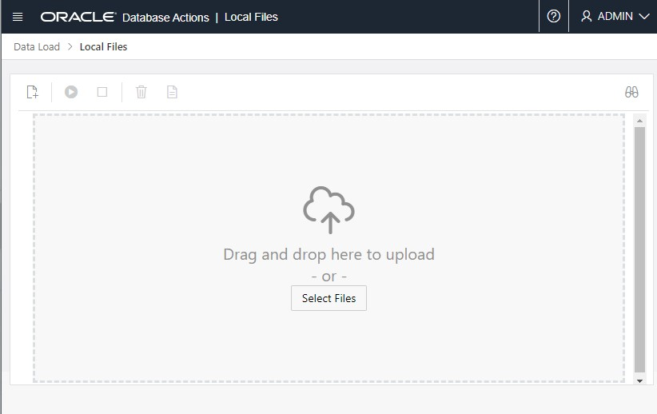
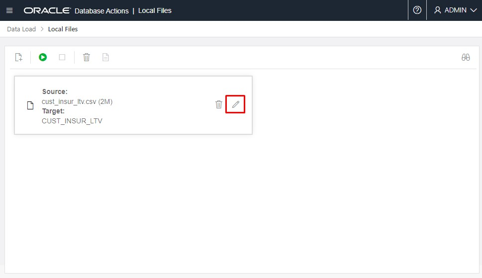
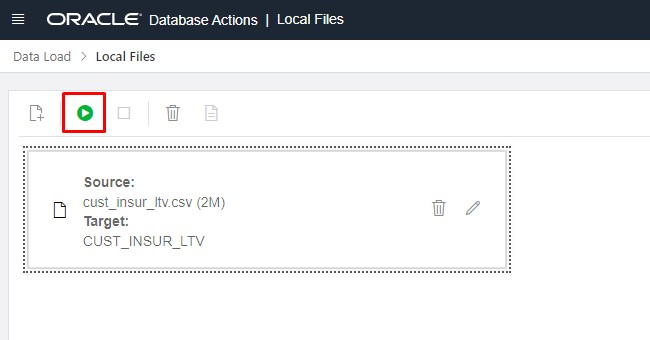
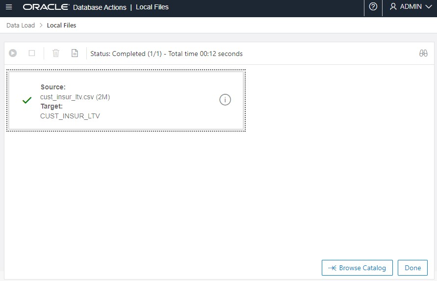
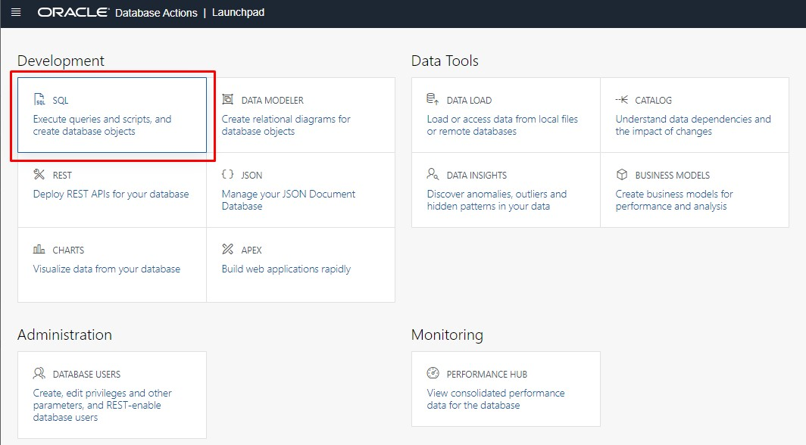
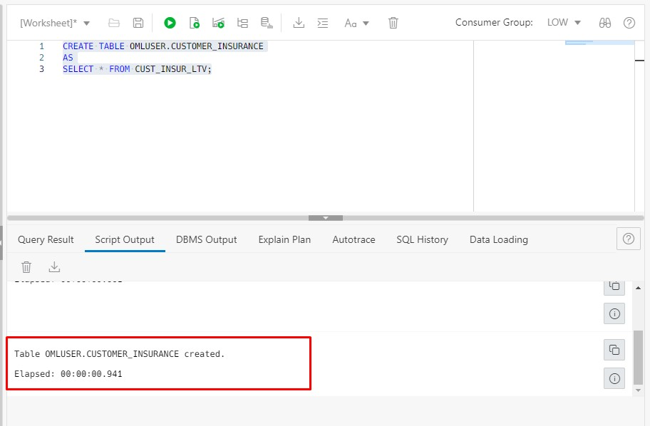

# Using REST Services with Oracle Machine Learning

## Introduction

In this lab we would do the setup needed for the labs.

In marketing, [life-time value (LTV)](https://en.wikipedia.org/wiki/Customer_lifetime_value) is a prognostication of the net profit contributed to the whole future relationship with a customer.

Estimated Lab Time: 15 minutes

### Objectives
*	Connect to Autonomous Dataware House ( ADW)
*	Obtain information from OCI to connect i.e., Get Tenancy ID,
* Load data into ADW
*	Create user account for ML services
*

### Prerequisites
* Oracle Cloud Infrastructure (OCI) account
* Autonomous Database deployed in Oracle Cloud


### Lab Preparation:


## Task 1: Get Tenancy ID

* Connect to the Oracle Cloud Infrastructure (OCI) Console. In the home page click on the user icon on the top right side.


* In the Users menu click on Tenancy: `<tenancy_name>` .


* The Tenancy Details page is displayed. You can see the full OCID by clicking on the Show button.


* The full tenancy OCID is displayed. You can copy it by clicking on the Copy button and save it somewhere accessible for the duration of the workshop. We are going to use it in the next sections of the workshop.


## Task 2: Get Autonomous Database dbname

* Click on the Menu button next to the Oracle Cloud icon.


* Go to the Oracle Database menu and chose Autonomous Transaction Processing.


* Click on the target Autonomous Database instance.


* In the Autonomous Database instance detail page you can see the Database Name.


You can save the Database Name somewhere accessible for the duration of the workshop. We are going to use it in the next sections when defining de endpoints to access the OML models.


## Task 3: Loading the data

* Connect to the Oracle Cloud Infrastructure (OCI) Console and go to Autonomous Database home page.
* Click on the target Autonomous Database instance


* In the Autonomous Database instance detail page, click on the Tools tab.


* Database administration and developer tools for Autonomous Database tab is now active. Click **Open Database Actions**.


* When prompt, enter the **Admin** username.


* When prompt, enter the password for the Admin user and click Sign in.


* Database Actions Launchpad page is now open. Here we have multiple tools available to easily manage and use the database, develop new applications or REST modules or manage the data inside the database.

 We will chose Data Load option in the Data Tools category.


* In the Data Load menu, chose Load Data and Local File and click Next.


* Download the [cust\_insur\_ltv.csv](https://objectstorage.eu-frankfurt-1.oraclecloud.com/p/NIPrIgDVBKsOBi_xnF5_ZHWAnlilwwnUbrgQbUA24iupm6ryoNkvp_KZ9qywzpQE/n/oraclepartnersas/b/ADB_Stage/o/cust_insur_ltv.csv) and load it using Drag and drop or Select Files option.


* The file is parsed and an entry is displayed on the screen. We can check the settings clicking on the pencil icon.


* The Data Load settings page opens.


Notice the default options here.
 - The create table option in case the table doesn't exist.
 - The default pre-filled table name is the file name.
 - The default encoding properties to be able to read the CSV file.
 - The mapping is for the column name and for the data type

Leave the default settings and click Close.

* Click run to start the Data Load.


The data loading process takes less than a minute. When is completed notice the green check mark and click Done.


The next step is to create the OML User and to add the data in his schema.

## Task 4:  Create the OMLUSER user

* Returning in the Autonomous Database instance Tools tab, click on the **Open Oracle ML User Administration**


* In the Oracle Machine Learning Database Administrator credentials page enter the username: **ADMIN** and his password.


* In the Machine Learning User Administration  we see only the Admin user with the System Administrator role. Click on the Create button to create another user.


* In the Create User page enter the following:


    - Username: **OMLUSER**;
    - Email Address: **An email address**;
    - **Un-check**: Generate password and email the account details to user;
    - Password: Chose a password. Throughout the workshop we are using **Welcome12345** as a password for OMLUSER;
    - Confirm Password: **Retype the password**;


Click Create.


* Now we have another user named OMLUSER available.


OMLUSER is also a database user and for the moment he doesn't have access to the customer insurance data we loaded in the admin user. so the next step is to move the data in the OMLUSER schema.


## Task 5:  Move the data in OMLUSER schema

* Returning in the Autonomous Database instance Tools tab.Click **Open Database Actions**.


* When prompt, enter the **Admin** username.


* When prompt, enter the password for the Admin user and click Sign in.


* In the Database Actions Lounchpad click SQL to open Sql Developer web.


* SQL Developer web opens.


Notice that it resembles the look and feel of the Sql Developer application. In the Left side we see the user: Admin and the table owned by the user. in our case it is just the **CUST\_INSUR\_LTV** table.

Write the following script to create the **CUSTOMER_INSURANCE** table in OMLUSER schema and click the Run button.

````
<copy>
CREATE TABLE OMLUSER.CUSTOMER_INSURANCE
AS
SELECT * FROM CUST_INSUR_LTV;
</copy>
````


* The table was created successfully.


The next part is to use this data and create an AutoML model.


## Acknowledgements
* **Authors** -  Andrei Manoliu, Milton Wan
* **Contiributors** - Rajeev Rumale
* **Last Updated By/Date** -  Andrei Manoliu, November 2021

## Need Help?
Please submit feedback or ask for help using our [LiveLabs Support Forum](https://community.oracle.com/tech/developers/categories/livelabsdiscussions). Please click the **Log In** button and login using your Oracle Account. Click the **Ask A Question** button to the left to start a *New Discussion* or *Ask a Question*.  Please include your workshop name and lab name.  You can also include screenshots and attach files.  Engage directly with the author of the workshop.

If you do not have an Oracle Account, click [here](https://profile.oracle.com/myprofile/account/create-account.jspx) to create one.
