## OML4R Live Lab

Oracle Machine Learning for R (OML4R) enables you to use R (a leading statistical programming language) for statistical analysis, data exploration, machine learning, and graphical analysis of data stored in an Oracle database. Using OML4R allows you to benefit from the simplicity of R and the power of Oracle Database without the need to deal with the complexities of sourcing, moving, and securing data. OML4R is the new name for Oracle R Enterprise.

In this workshop, you will use a dataset representing about 15,000 customers of an insurance company. Each customer record has about 30 attributes. Your goal is to train a Machine Learning model to predict a given customer's life-time value (or LTV) and their LTV_BIN placement. You will use a regression algorithm to predict LTV, and a classification algorithm to predicts customers’ LTV_BIN assignments (LOW, MEDIUM, HIGH, or VERY HIGH)

Note: In marketing, the life-time value (LTV) of a customer is an estimate of the net profit attributed to a given customer relationship over its lifetime.

### Estimated Lab Time: 2 Hours

### Objectives

In this lab, you will:

* Establish a connection from RStudio Web to your Oracle Database instance.
* Explore, visualize, and prepare data for analysis and machine learning.
* Use R for exploratory data analysis, data visualization, data organization (e.g., bucketing of data in train and test buckets),
* Use Attribute Importance, Principle Component Analysis, model building, and model validations techniques
* Use an OML4R regression algorithm for building and training a ML model for estimating customer life-time value (LTV)
* Use an OML4R classification algorithm for building and training a ML model for LTV_BIN assignment
* Validate predictions using RMSE (Root Mean Squared Error) and Confusion Matrix methods

Note: 
1. We will not be using AutoML UI in this lab. AutoML UI is currently not available for OML4R (it is only available for OML4Py). 
2. We will not be using Autonomous Database as OML4R is currently not available for Autonomous Database.

### Pre-requisites

* Oracle Database 21c, 19c, or 18c installed on-premises (or in a VM in Cloud)
* R, RStudio Server, and required libraries

## Task 1: Connect to RStudio Client and Establish Database Connection

RStudio provides an IDE (Integrated Development Environment) for R with a GUI (Graphical User Interface) and BUI (Browser User Interface). Note that RStudio Server has been pre-configured on your VM that is running the database server.

You will be running all the lab steps in the RStudio R Script window as shown below.

<IMAGE>

1.1: Point Browser To RStudio Web

```
http://<ip-address>:8787
```

Alternatively, you can use RStudio Desktop as your IDE, if you prefer.

1.2: Provide Username & Password

Use the provided username and password to connect to the database schema.

```
Username: omluser 
Password: MLlearnPTS#21_
```
            


The RStudio interface looks as follows.

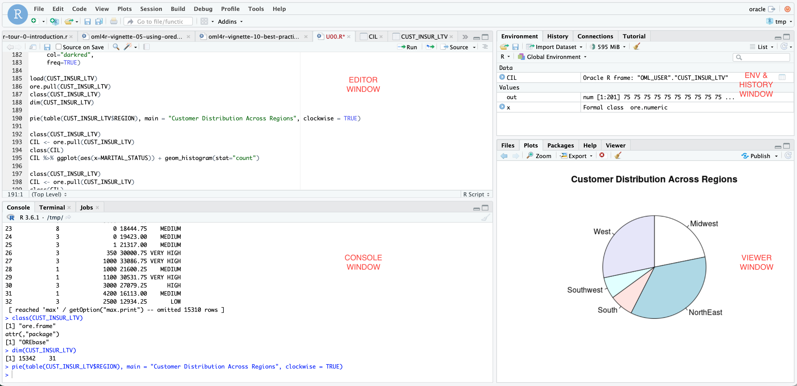

1.3: Install packages

```
if (!require(“ORE”)) install.packages(“ORE”) 
if (!require(“dplyr”)) install.packages(“dplyr”) 
if (!require(“OREdplyr”)) install.packages(“OREdplyr”) 
if (!require("caTools")) install.packages("caTools") 
if (!require(“janitor”)) install.packages(“janitor”) 
```

The above checks the existence of the given package in the present installation. It only installs the package if the given package is not already already installed, thus eliminating redundant installation of packages.

1.4: Load Libraries

The library() function call installs (loads) the given library in to memory and makes the included functions available. If a call to a function is made and the corresponding library is not already installed, you get an error.

```
library(ORE)
library(dplyr)
library(OREdplyr)
```

ORE - The ORE libraries are a set of packages that contains many useful R functions.

dplyr - The standard dplyr R package provides grammar of data manipulation, which gives a consistent set of verbs that help you solve the most common data manipulation challenges

OREdplyr - The OREdplyr package is an overloaded package that provides much of the dplyr functionality. It extends the ORE transparency layer for in-database execution of dplyr function calls. OREdplyr allows users to avoid costly movement of data while scaling to larger data volumes. Further, using the transparency layer operations are not constrained by R client memory, the latency of data movement, or single-threaded execution. 

1.5: Set Global Options To Disable Unnecessary Warning Messages

Oracle Machine Learning for R provides the ability to create ordered or unordered ore.frame objects. Using an ordered ore.frame object that is a proxy for a SQL query can be time-consuming for a large data set. Therefore, although OML4R attempts to create ordered ore.frame objects by default, it also provides the means of creating an unordered ore.frame object.

The ore.warn.order global option specifies whether you want OML4R to display a warning message if you use an unordered ore.frame object in a function that requires ordering. If you know what to expect in an operation, then you might want to turn the warnings off so they do not appear in the output.

```
options(ore.warn.order=FALSE)
```

1.6: Connect To Database

An Oracle 21c database instance (named MLPDB1) has been provisioned for you to run this lab. Connect to the provided database using the ore.connect() function as follows:

```
ore.connect(user="oml_user",
            conn_string="MLPDB1",
            host=<hostname>,
            password=<password>,
            all=TRUE)
```

Your database connection is to the database schema where the data resides. The connection port defaults to 1521. 

By specifying “all = TRUE” in the connection specifications, proxy objects are automatically loaded for all tables in the target schema to which you are connecting.

Example:

```
ore.connect(user="oml_user",
            conn_string="MLPDB1",
            host="130.61.185.99",
            password="MLlearnPTS#21_",
            all=TRUE)
```

1.7: Check Database Connection

```
ore.is.connected()
```

If needed, you can use ore.disconnect() call to explicitly disconnect the database session.

1.8: List Database Objects

The ore.ls() function returns all OML4R proxy objects. Use the ore.ls() function call to list tables in the database schema you are connected to, which appear as ore frames in your OML4R session. The conversion is transparent and it is enabled by the OML4R transparency layer.

```
ore.ls()
```

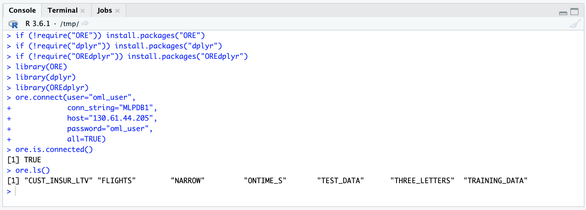

## Task 2: Explore Data Using R

Exploratory Data Analysis is the process of visualizing and analyzing data to develop better understanding of the data and gain insight into the data.

### BASIC DATA EXPLORATION USING STATISTICAL FUNCTIONS


2A.1: Check ‘class’ Of Object

```
class(CUST_INSUR_LTV)
```

The database table appears as "ore.frame". An ore.frame is the R object representation of the CUST_INSUR_LTV table in the database. 

There are 6 types of objects in R Programming. They include vector, list, matrix, array, factor, and data frame. An ore.frame object represents a relational (SQL) query to an Oracle Database instance. It is the OML4R equivalent of a data.frame.

2A.2: Get List Of Column Names (‘colnames’)

```
colnames(CUST_INSUR_LTV)
```

The column names appear in an ordered list and can be referenced based on this order.


2A.3: Check Object or Frame Dimensions

```
dim(CUST_INSUR_LTV)
```

The dimensions represents the number of rows (i.e., records or observations ) and number of columns (or variable, or attributes) in the given frame (table).

Your result should be: "15342 31", which means there are 15342 records or observations (rows) in the table and each record has 31 attributes (columns).

            
            
            
2A.4: Summary (Categorical and Numerical Variables)

```
summary(CUST_INSUR_LTV[,8:31])
```

You can also specify one or more, or a range of columns to see the summary of only those columns.

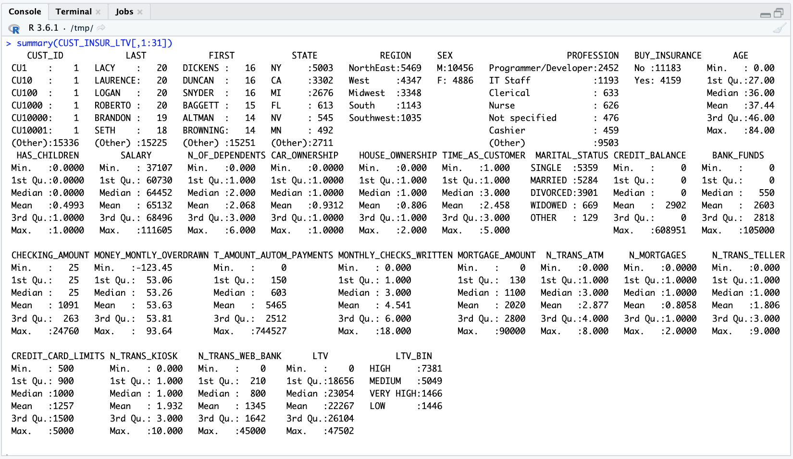

The "summary" command summarizes all the mentioned attributes, how many, how much, minimum values, maximum values, etc. Notice the reference to the given set of columns (attributes) of the table using the order numbers for the columns. You can also see a summary of individual attributes by specifying a specific column by name or number.

2A.5: Statistical Functions (min, max, mean, mode, median, range, unique, quantile)

```
min(CUST_INSUR_LTV$SALARY)

max(CUST_INSUR_LTV$AGE)
```

Mean is the statistical average.

```
mean(CUST_INSUR_LTV$SALARY)

mean(CUST_INSUR_LTV$LTV)
```

Mode is the most frequently occurring observation or attribute.

```
names(table(CUST_INSUR_LTV$N_OF_DEPENDENTS))[table(CUST_INSUR_LTV$N_OF_DEPENDENTS)==max(table(CUST_INSUR_LTV$N_OF_DEPENDENTS))]
```

Median represents the middle value.

```
median(CUST_INSUR_LTV$AGE)
```

Range provides end-to-end range of numeric values.

```
range(CUST_INSUR_LTV$SALARY)
```

Unique provides the set of unique or distinct values in the data set for a given attribute or variable.

```
unique(CUST_INSUR_LTV$REGION)
```

Quantiles may be useful to identify outlier limits. The generic function 'quantile()' produces sample quantiles corresponding to the given probabilities. The smallest observation corresponds to a probability of 0 and the largest to a probability of 1.

```
quantile(CUST_INSUR_LTV$SALARY, 0.025)

quantile(CUST_INSUR_LTV$SALARY, 0.975)

```

Your results should show the following outputs.


### DATA VISUALIZATION 

2B.1: Simple Plot

Draw a simple and quick plot of customer salary.

This basic plot illustrates the overall distribution of cusomer's salary and the range within which it falls. You clearly see a dense band where most customers fall between about $50K to about $80K.

```
plot(CUST_INSUR_LTV$SALARY/1000, xlab = "Customer", ylab = "Salary in K$", main = "Customer Salary Plot")
```

Your plot should look as follows.

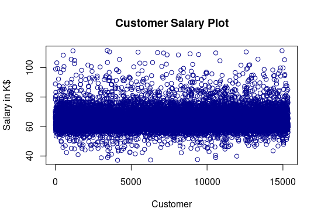

2B.2: Boxplot 

Plot the age attribute using a simple boxplot.

A simple boxplot can help you quickly see the concentration of customers in specific bands.

```
CIL <- CUST_INSUR_LTV
x <- CIL$AGE
out <- boxplot.stats(CUST_INSUR_LTV$AGE)$out
boxplot(CUST_INSUR_LTV$AGE, xlab = "Boxplot (AGE)", horizontal=TRUE)
text(x=fivenum(x), labels = fivenum(x), y=1.35)
mtext(paste("Outliers: ", paste(unique(out), collapse = ", ")))
```

Your output should look as follows.


A boxplot displays distribution of data based on a 5-number summary (“minimum”, first quartile (Q1), median, third quartile (Q3), and “maximum”). A boxplot makes it easy to see outliers and what their values are. It can also indicate if your data is symmetrical, general grouping of data, and data skew.

The above boxplot illustrates the distribution of data with a smallest (not minimum) value of 0, a highest (not maximum) value of 74, and an interquartile range from 27 to 46, with a median right in the center of these two (at 36) as depicted by the solid line. Values ranging from 75 to 84 are shown as outliers.

2B.3: Histogram

Plot a marked up histogram for customer salary data.

Histograms help see distribution of data in range bands. Note, R / ORE transparently identifies what it sees as appropriate band ranges.

```
hist(CUST_INSUR_LTV$SALARY/1000,
main="Customer Salary Data",
xlab="Salary($K)",
xlim=c(20,100),
col="darkred”,
freq=TRUE)
```

Your output should look as follows.
            


2B.4: Pie Chart

Generate a pie chart for region wise distribution of customers.

```
pie(table(CUST_INSUR_LTV$REGION), main = "Customer Distribution Across Regions", clockwise = TRUE)  
```

Your output should look as follows.
            
            


Note that CLOCKWISE signifies the alphabetical order. 


2B.5: ggPlot

Generate a ggplot for visualizing LTV for various regions.

```
class(CUST_INSUR_LTV)
CIL <- ore.pull(CUST_INSUR_LTV)
class(CIL)
CIL %>% ggplot(aes(x=REGION,y=LTV,color=REGION)) + geom_boxplot() 
```

Your output should look as follows.

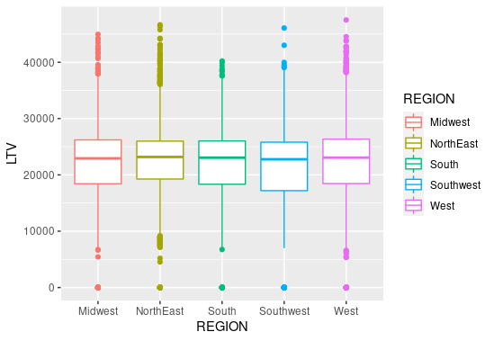

Let’s look at another ggplot for Salary distribution in all regions.

```
class(CUST_INSUR_LTV)
CIL <- ore.pull(CUST_INSUR_LTV)
class(CIL)
suppressWarnings(print(CIL %>% ggplot(aes(x=MARITAL_STATUS)) + geom_histogram(stat="count") ))
```

Your output should look as follows.

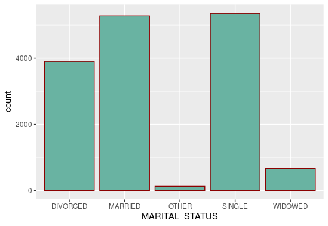

Let’s also look at the age distribution in the customer base.

```
class(CUST_INSUR_LTV)
CIL <- ore.pull(CUST_INSUR_LTV)
class(CIL)
suppressWarnings(print(CIL %>% ggplot(aes(x=AGE)) + geom_density(stat="count") ))
```

Your output should look as follows.

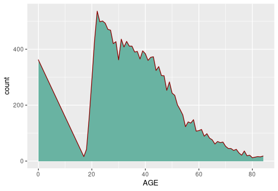


Note that ggplot works against a data frame. The ore.pull command takes the ORE frame and converts it into an R data frame.


### TARGETED DATA EXPLORATION

2C.1: Filtering Data and Aggregate Data View

Use the filter() function to filter data based on given criteria.

```
filter(CUST_INSUR_LTV, REGION == "NorthEast")

filter(CUST_INSUR_LTV, SALARY > 110000)

nrow(CUST_INSUR_LTV %>% filter(SALARY > mean(SALARY, na.rm = TRUE)))
```

Note that the 'na.rm' specification directs treatment of non-available measurements. 'na.rm = TRUE' removes missing values from the dataset if they are coded as NA.

Use the aggregate() function to group data based on given column or set of columns.

```
aggregate(CUST_INSUR_LTV$LTV_BIN, by = list(LTV_BIN = CUST_INSUR_LTV$LTV_BIN),FUN = length)
```

You should see output as follows.


2C.2: Missing and Zero Values

Check number of observations (records) where customer age is specified as 0.

```
nrow(CUST_INSUR_LTV %>% filter(AGE < 1, na.rm = TRUE))
```

2C.3: Removing & Adding Variables (Columns)

dim(CUST_INSUR_LTV)
CUST_INSUR_LTV <- subset(CUST_INSUR_LTV, select = -c(LTV_BIN))
dim(CUST_INSUR_LTV)
CUST_INSUR_LTV$LTV_BIN_PRED <- ""
dim(CUST_INSUR_LTV)

You should see output as follows.

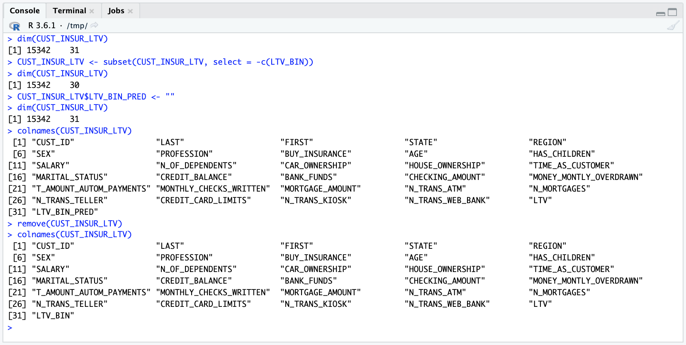

2C.4 Fine Tuning The Given Dataset

Check existence of duplicate data.

```
nrow(get_dupes(CXL, CUST_ID))
```

Remove data from the frame where customer age is zero or not specified.

```
dim(CUST_INSUR_LTV)
CUST_INSUR_LTV <- (CUST_INSUR_LTV %>% filter(AGE > 1, na.rm = TRUE))
nrow(CUST_INSUR_LTV)
```

Select data for the “NorthEast” region only.

```
dim(CUST_INSUR_LTV)
CUST_INSUR_LTV <- (CUST_INSUR_LTV %>% filter(REGION == “NorthEast”, na.rm = TRUE))
nrow(CUST_INSUR_LTV)
```

You should see output as follows.


2C.4: Assess Attribute Importance For LTV_BIN Prediction

Use Attribute Importance to identify attributes of high relevance in predicting target dependent variable.

The ore.odmAI() function can be used to run Attribute Importance on the given dataset. This helps identify attributes in the given dataset that are important in predicting the given dependent attribute (LTV_BIN in this case). 

In order to use the ore.odmAI() function effectively, you should first exclude the most significant dependent attributes from the data frame. For example, exclude LTV attribute when predicting LTV_BIN and exclude LTV_BIN when predicting LTV.

Assess attribute importance for dependent variable LTV_BIN. As you know that LTV_BIN is highly correlated with LTV. Thus first exclude LTV from the data frame.

```
CIL <- CUST_INSUR_LTV
CIL$LTV <- NULL
dim(CIL)
```

Notice the dimensions now show (15342 30), and not (15342 31) as was originally the case. Now, run the odmAI() function to identify ordered importance of attribute for target variable LTV_BIN.

```
ore.odmAI(LTV_BIN ~ ., CIL)
```

Note: The output lists all the important attributes and their relative influence on the target attribute (LTV_BIN).

Your result should look like the ranking below with House Ownership as the highest importance for determine LTV_BIN, and Customer ID as the least important.


2C.5: Assess Attribute Importance For LTV Prediction

Use Attribute Importance (the ore.odmAI() function) to identify attributes of relative importance for a LTV prediction with the given dataset.

```
CIL <- CUST_INSUR_LTV
CIL$LTV_BIN <- NULL
dim(CIL)
ore.odmAI(LTV ~ ., CIL)
```

Attribute importance ranks attributes according to their significance in predicting a target. The ore.odmAI() function produces a ranking of attributes and their importance expressed as a fraction.

As seen below, Attribute Importance (AI) ranks attributes according to their significance in predicting a target. 


The model object is not retained, and an R model object is not returned. Only the importance ranking created by the model is returned.

Do you notice the difference between AI output for LTV and for LTV_BIN?.

2C.6: Principal Component Analysis

Principal Component Analysis (PCA) is a technique used for exploratory data analysis, and to visualize the existing variation in a dataset that has several variables. PCA is particularly helpful when dealing with wide datasets (where each record has many attributes). PCA allows you to simplify a dataset by turning the original (many) variables into a smaller number of what are termed as "Principal Components".

```
prc0 <- prcomp(~  HOUSE_OWNERSHIP + N_MORTGAGES + MORTGAGE_AMOUNT + AGE + SALARY + N_OF_DEPENDENTS, data = CUST_INSUR_LTV, scale. = TRUE)

summary(prc0)
```

Setting the argument scale=TRUE, standardizes the input data so that it has zero mean and variance one before doing PCA.

The output below should illustrate the relative significance of the principal components used from the dataset.


The summary() function in the result object shows standard deviation, proportion of variance explained by each principal component, and the cumulative proportion of variance.


## Task 3: Build Regression Model for LTV Prediction & Validate Model


3.1: Create Ordered ORE Frame

Use the primary key of a database table to order an ore.frame object.

The set.seed() function sets the seed of R‘s random number generator, which is useful for creating simulations or random objects that can be reproduced.

This example ensures that CUST_INSUR_LTV is an ordered ore.frame by assigning the values of the CUST_ID column as the row names of CUST_INSUR_LTV.

```
set.seed(1)
head(CUST_INSUR_LTV)
CIL <- CUST_INSUR_LTV
row.names(CIL) <- CIL$CUST_ID
head(row.names(CIL))
```

The output should show the following.


Note: Using an ordered ore.frame object that is a proxy for a SQL query can be time-consuming for a large data set. Therefore, although OML4R attempts to create ordered ore.frame objects by default, it also provides the means of creating an unordered ore.frame object.

3.2: Partition Data For Training & Testing

Split the dataset into two buckets - training data set (~70%), and testing data set (~30%).

The 'seed' can be set to any value. Setting a 'seed' ensures the same output is reproduced by the R psuedonumber generator, if your run the code again. This can be helpful for consistency and debugging purposes.

```
set.seed(1)

sampleSize <- 4600

ind <- sample(1:nrow(CIL),sampleSize)
group <- as.integer(1:nrow(CIL) %in% ind)
CIL.train <- CIL[group==FALSE,]
CIL.test <- CIL[group==TRUE,]
```

Note that the sample size is specified as 4600 (about 30% of the dataset volume).

3.3: Check Class & Dimensions Of Training And Test Datasets

```
class(CIL.train)
dim(CIL.train)
class(CIL.test)
dim(CIL.test)
```

Your output should look as follows.

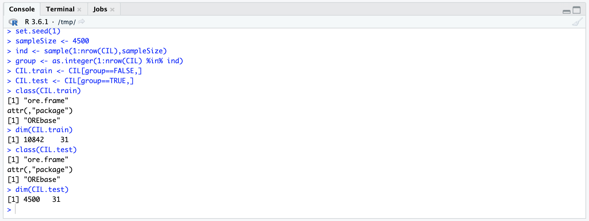

3.4: Build Model

Build a REGRESSION MODEL to predict customer LTV using the training data set.

```
oreFit1A <- ore.odmGLM(LTV ~ HOUSE_OWNERSHIP + N_MORTGAGES + MORTGAGE_AMOUNT + N_TRANS_WEB_BANK + N_OF_DEPENDENTS, data = CIL.train, ridge=TRUE)

oreFit1A %>% print()
```

Your output should look as follows.


3.5: Check Model Details

Check details of the REGRESSION MODEL created above.

```
class(oreFit1A)

summary(oreFit1A)

oreFit1A$formula

head(oreFit1A$residuals)
```

Your output should look as follows.

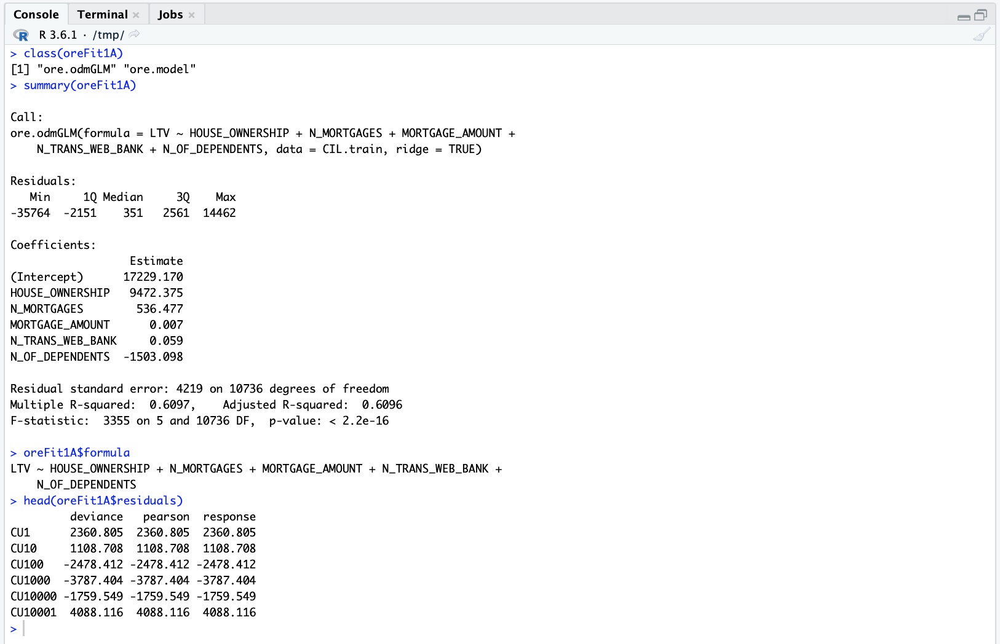

3.6: Generate Predictions

Generate LTV predictions using ore.predict.

The ore.predict function is invoked on a model. For example, the following code generates predictions (predA) by invoking ore.oredict() on the oreFit1 model produced above and uses CIL.test dataset to score the model.

```
pred1A = ore.predict(oreFit1A, newdata = CIL.test)

head(pred1A)
```

Your output should look as follows.


3.7: Compare Actual & Predicted Values

```
CIL_pred <- ore.predict(oreFit1A, CIL, se.fit = TRUE, interval = "prediction")
CIL <- cbind(CIL, CIL_pred)
head(select (CIL, LTV, PREDICTION))
```

Your output should look as follows.


3.8: Compute RMSE

Check Root Mean Squared Error (RMSE) to assess prediction accuracy as produced by the model.

Root Mean Square Error (RMSE) is a metric that indicates the average distance between the predicted values from a model and the actual values in the dataset. A lower RMSE is desirable. Lower RMSE indicates a better “fit” of the model for the given dataset.

```
ans <- predict(oreFit1A, newdata = CIL.test, supplemental.cols = 'LTV')
localPredictions <- ore.pull(ans)
ore.rmse <- function (pred, obs) {
sqrt(mean(pred-obs)^2)
}

ore.rmse(localPredictions$PREDICTION, localPredictions$LTV)
```

Your output should show the following:


Recall that the average (mean) LTV as calculated previously was $22266.67. Thus a value of 48.46 is relatively low, suggesting a good model fit.

Plot the predictions alongside actual LTV value.

localPredictions %>% ggplot(aes(x=PREDICTION, y=LTV, color=PREDICTION)) + geom_point()

Your output should show the following:

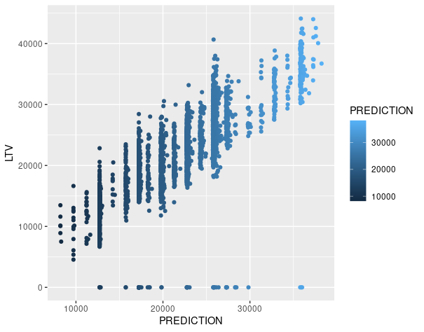


RMSE is a useful way to determine the extent to which a regression model is capable of integrating a dataset. The larger the difference indicates a larger gap between the predicted and observed values, which means poor regression model fit. In the same way, the smaller RMSE that indicates the better the model. Based on RMSE we can compare the two different models with each other and be able to identify which model fits the data better. 

There is no ideal value for RMSE as it depends on the magnitude of the measure.

3.9: Store (Save) Model In Database

```
ore.save(oreFit1A)
```


## Task 4: Build Classification Model for LTV_BIN Prediction  & Validate Model

4.1: Create Ordered ORE Frame

Use the primary key of a database table to order an ore.frame object.

The set.seed() function sets the seed of R‘s random number generator, which is useful for creating simulations or random objects that can be reproduced.

This example ensures that CUST_INSUR_LTV is an ordered ore.frame by assigning the values of the CUST_ID column as the row names of CUST_INSUR_LTV.

```
set.seed(1)
CIL <- CUST_INSUR_LTV
row.names(CIL) <- CIL$CUST_ID
head(row.names(CIL))
```

Note: Using an ordered ore.frame object that is a proxy for a SQL query can be time-consuming for a large data set. Therefore, although OML4R attempts to create ordered ore.frame objects by default, it also provides the means of creating an unordered ore.frame object.

4.2: Partition Data For Training & Testing

Partition the original dataset for training and testing purposes.

Split the dataset into two buckets - training data set (~70%), and testing data set (~30%).

The 'seed' can be set to any value. Setting a 'seed' ensures the same output is reproduced by the R psuedonumber generator, if you run the code again. This can be helpful for consistency and debugging purposes.

```
set.seed(1)
sampleSize <- 4600
ind <- sample(1:nrow(CIL),sampleSize)
group <- as.integer(1:nrow(CIL) %in% ind)
CIL.train <- CIL[group==FALSE,]
CIL.test <- CIL[group==TRUE,]
```


4.3: Check Class & Dimensions Of Training And Test Datasets

```
class(CIL.train)
dim(CIL.train)
class(CIL.test)
dim(CIL.test)
```

Your results should be as follows.

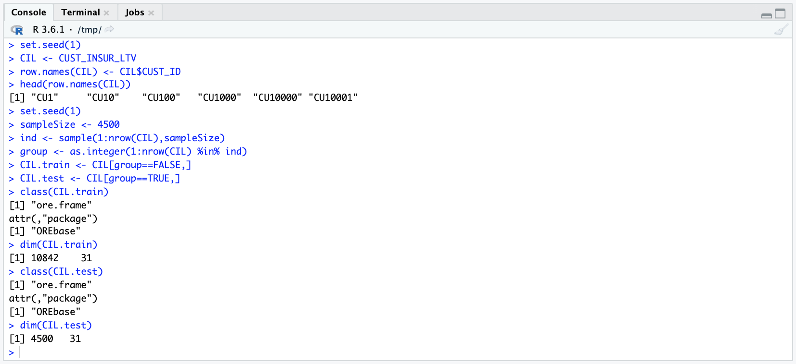


4.4: Build Model

Build a CLASIFICATION MODEL using NAIVE BAYES algorithm and the training data set for predicting customer LTV_BIN assignment.

```
oreFit2A <- ore.odmNB(LTV_BIN ~ HOUSE_OWNERSHIP + N_MORTGAGES + MORTGAGE_AMOUNT + N_TRANS_WEB_BANK + N_OF_DEPENDENTS, data = CIL.train)

oreFit2A %>% print()
```

Your results should be as follows.


4.5: Check Model Details

```
summary(oreFit2A)

names(oreFit2A)

oreFit2A$formula
```

Your results should be as follows.


4.6: Generate Predictions for LTV_BIN

```
predB = ore.predict(oreFit2A, newdata = CIL.test)

predB
```

Your results should be as follows.


4.7: Compute Confusion Matrix

Now, let us look at the confusion matrix to compare the aggregate predictions with actual data.

```
with(oreFit2A.res, table(LTV_BIN,PREDICTION, dnn = c("Actual","Predicted")))
```

Your results should be as follows.

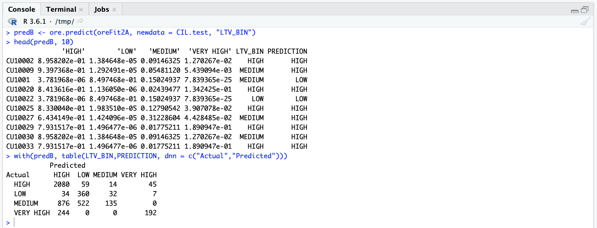


A confusion matrix is used to describe the performance of a classification model on a test dataset for which the actual or true values are known. It is usually presented in a table format. The confusion matrix depicts TRUE POSITIVES, TRUE NEGATIVES, FALSE POSITIVES, and FALSE NEGATIVES. The accuracy is easy to calculate by computing (TP + TN / TOTAL SAMPLE SIZE).

4.8: Store (Save) Model In Database

```
ore.save(oreFit2A)
```

4.9: Optionally, use another algorithm to create a different model and compare the results. 

For example, the following creates a classification model using the DECISION TREE algorithm. 

```
CIL <- CUST_INSUR_LTV
CIL$LTV_BIN <- NULL
dim(CIL)

oreFit2B <- ore.odmDT(LTV_BIN ~ ., data = CIL.train)
oreFit2B <- ore.odmDT(LTV_BIN ~ HOUSE_OWNERSHIP + N_MORTGAGES + MORTGAGE_AMOUNT + N_TRANS_WEB_BANK + N_OF_DEPENDENTS, data = CIL.train)
oreFit2B %>% print()
summary(oreFit2B)
names(oreFit2B)
oreFit2B$formula

oreFit2B.res <- predict (oreFit2B, CIL.test, "LTV_BIN")
head(oreFit2B.res,10)
with(oreFit2B.res, table(LTV_BIN,PREDICTION, dnn = c("Actual","Predicted")))
```

Your results should be as follows.

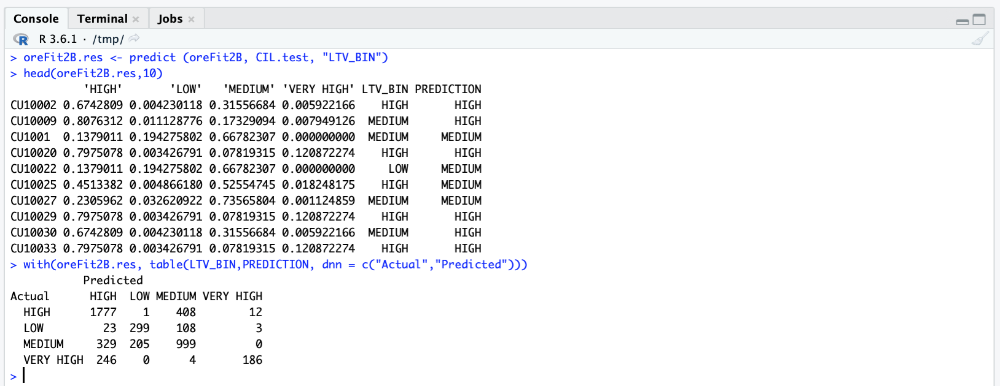


How does the confusion matrix compare with the one generated previously?


## Task 5: Use Embedded R Functions To Leverage In-Database Parallel Processing

5.1: Embedded R For Real-Time Model Building And Predictions

Some of the most significant benefits of using OML4R can be derived from using Embedded R execution in your applications. Embedded R allows you to store and run R scripts in the database through either an R interface or a SQL interface, or both the interfaces.

```
test <- function() {
  library(ORE)
  ore.connect(user="oml_user",
              conn_string="MLPDB1",
              host="rinst5d",
              password="oml_user",
              all=TRUE)
  CIL <- ore.pull(CUST_INSUR_LTV)
  row.names(CIL) <- CIL$CUST_ID
  sampleSize <- 4600 
  set.seed(1) 
  ind <- sample(1:nrow(CIL),sampleSize) 
  group <- as.integer(1:nrow(CIL) %in% ind) 
  CIL.test <- CIL[group==TRUE,] 
  CIL.train <- CIL[group==FALSE,] 
  glmfit1 <- glm(LTV ~ N_MORTGAGES + MORTGAGE_AMOUNT + N_OF_DEPENDENTS, data = CIL.train)
  pred <- predict(glmfit1, newdata = CIL.test)
  pred 
}
```

Your results should be as follows.


Note: The above example function performs a number of steps including preparing the data, building the machine learning model, and then using it predict the target attribute. Many times all this may be unnecessary if all you want to do it to load and use a pre-build machine learning model, already stored in the database.

Now, check the predicted values. You can of course, use it in different ways in an application.

```
res <- ore.doEval(FUN=test)
res
```

Your results should be as follows.


5.2: Embedded R for Real-Time LTV_BIN Prediction Using Pre-Built Classification Model

Using ore.tableApply

```
res1 <- ore.tableApply(CUST_INSUR_LTV, 
  function(dat){
    mod1 <- ore.lm(LTV ~ HOUSE_OWNERSHIP + N_MORTGAGES + MORTGAGE_AMOUNT, dat)   
    mod1
  })
```

Save the results and verify.

```
ore.save(res1, name="MY_DS", overwrite=TRUE)
class(res1)
typeof(res1)
res1.local <- ore.pull(res1)
class(res1.local)
summary(res1.local)
```

Using ore.groupApply

res2 <- ore.groupApply(CUST_INSUR_LTV,
                       INDEX = CUST_INSUR_LTV$CUST_ID,
                       function(dat) {
                         lm(LTV ~ HOUSE_OWNERSHIP + N_MORTGAGES + MORTGAGE_AMOUNT, dat)},
                       parallel = TRUE)

res2.local <- ore.pull(res2)
class(res2.local)
summary(res2.local)

5.3: Embedded R for Real-Time LTV Prediction Using Pre-Built Regression Model

<>

## Task 6: Conclusion

61:  Conclusion

OML4R enables you to leverage the power of R, a leading statistical programming language, with the Oracle Database, the world’s most advanced, and high-performance database. OML4R provides simple, easy to use functions to perform exploratory data analysis including statistical analysis, data visualization, and more advanced and targeted data analysis. OML4R uses overloaded R functions that leverage the powerful Oracle database backend to eliminate the need for data movement while utilizing in-database parallel processing. Embedded R enables you to use advanced machine learning capabilities in real-time and creates the possibility of generating unprecedented value from your database resident data.

6.2: Next Steps

a) Sign-up: OCI Always Free Tier

Consider signing-up for the Oracle Cloud Infrastructure Always Free Tier and use Oracle Machine Learning for R (as well as Oracle Machine Learning for Python and Oracle Machine Learning for SQL) for your development projects.

b) Get Certified: Oracle Machine Learning with Oracle Autonomous Database Certification
Consider taking the Oracle Machine Learning with Oracle Autonomous Database Certification offered by Oracle University.

