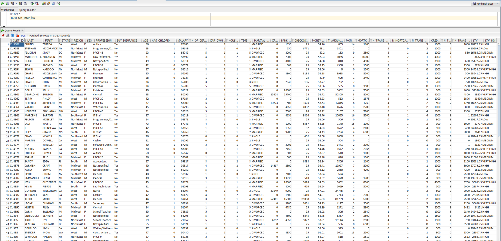
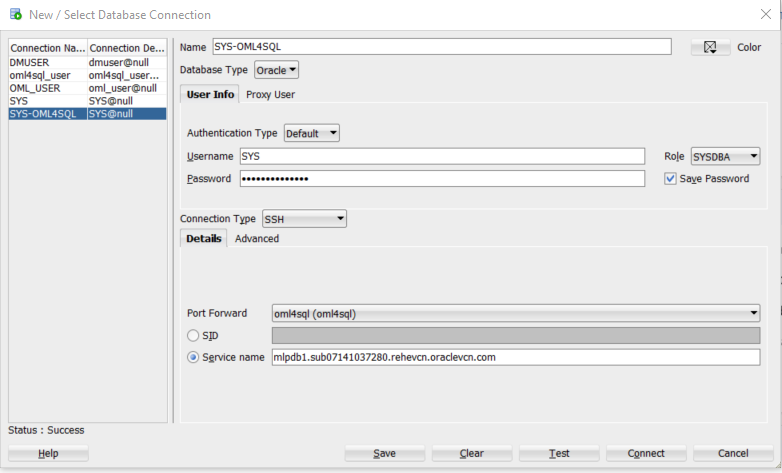

# Oracle Machine Learning for SQL (OML4SQL) - part 1

## Introduction

OML4SQL provides a powerful, state-of-the-art machine learning capability within Oracle Database. You can use OML4SQL to build and deploy predictive and descriptive machine learning applications, to add intelligent capabilities to existing applications, and to generate predictive queries for data exploration.

OML4SQL offers a comprehensive set of in-database algorithms for performing a variety of machine learning tasks, such as classification, regression, anomaly detection, feature extraction, clustering, and market basket analysis. The algorithms can work on standard case data, transactional data, star schemas, and text and other forms of unstructured data. OML4SQL is uniquely suited to the analysis of very large data sets.

**Oracle Machine Learning for SQL is a component of the Oracle Database Enterprise Edition.**

The PL/SQL API and SQL language operators provide direct access to OML4SQL functionality in Oracle Database. 


In this workshop, you have a dataset representing 15k customers of an insurance company. Each customer has around 30 attributes, and our goal is to train our database to find 4 Business Objectives that describe in [oml4sql-use-case.md](oml4sql-use-case.md) file.

For more information about [OML4SQL API Guide,](https://docs.oracle.com/en/database/oracle/machine-learning/oml4sql/21/dmapi/introduction-to-oml4sql.html#GUID-429CF74D-C4B7-4302-9C33-5292A664E2AD) 

Estimated Lab Time: 2 hours 

### Objectives

In this lab, you will:

* **Business Understanding**: (Be extremely specific in the problem statement) Examine the customer insurance historical data set and understand business.
* **Data Understanding**: (Review the data; does it makes sense?), Understand the meaning of fields. 
* **Data Preparation**: (Prepare the data, create new derived attributes or "engineered features") Examine the new customer data set that you needed to start to work.
* **Modeling**: (Training and testing ML models using 60%/40% random samples.) First, identify the key attributes that most influence the target attribute.
* **Evaluation**: Next, test model accuracy, make sure the model makes sense.
* **Deployment**: Apply the Models to Predict “Best Customers”, and give this tool to the people in the business who can best take advantage of it.


### Prerequisites

* Oracle Database 21c installed on-premise;
* Access the Oracle database containing the customer insurance table and run the scripts to configure the user and prepare data.
* SSH private key with which you created your VM on OCI. 
    
## Task 1: Business Understanding 
    
1. Review Business Objectives that describe in [oml4sql-use-case.md](oml4sql-use-case.md) file.

## Task 2: Data Understanding 

* Data information of insurance clients is like this:



* Sample of single record is like this:


* The most important field in this use case, is BUY_INSURANCE, because businesses need to know who is their buyer persona typical and atypical. 

## Task 3: Data Preparation 

1. It is recommended to have SQL Developer installed on your host machine so that you can interact with the data in a more friendly way.
* You can download here [SQL Developer Download,](https://www.oracle.com/tools/downloads/sqldev-downloads.html)

2. Once installed SQL Developer, you need to configure the remote connection in SSH Hosts of SQL Developer feature, following these instructions:


3. Rigth clic on SSH Hots and then do clic in New SSH Host, write values in each field and then clic Ok. 


4. Rigth clic on the fisrt oml4sql tab in SSH Hosts an clic connect, and then right clic in the submenu oml4sql tab an clic connect. 
Notice how the small padlock closes in both options, which represents that you are already remotely connected to your VM and you are ready to create a connection to your 

5. schema from SQL Developer. 


6. Create SQL Developer new database connection with **SYS** user to your Oracle 21c Pluggable Database, and test connectivity with password: **MLlearnPTS#21_**.



7. Once the database connection is open and SQL Developer Worksheet is ready, execute this script to create the user oml4sql_user and grant privileges to work with OML4SQL API, and generate a copy of table CUST_INSUR_LTV.
    
    ````
    <copy>
    DROP USER oml4sql_user;

	CREATE USER oml4sql_user IDENTIFIED BY oml4sql_user
       DEFAULT TABLESPACE USERS
       TEMPORARY TABLESPACE TEMP
       QUOTA UNLIMITED ON USERS;

	GRANT CREATE SESSION TO oml4sql_user;
	GRANT CREATE TABLE TO oml4sql_user;
	GRANT CREATE VIEW TO oml4sql_user;
	GRANT CREATE MINING MODEL TO oml4sql_user;
	GRANT EXECUTE ON CTXSYS.CTX_DDL TO oml4sql_user;
	GRANT SELECT ANY MINING MODEL TO oml4sql_user;

	GRANT SELECT ON OML_USER.CUST_INSUR_LTV TO oml4sql_user;
	CREATE TABLE oml4sql_user.CUST_INSUR_LTV AS
	SELECT *
	FROM OML_USER.CUST_INSUR_LTV;
    </copy>
    ````

8. Create SQL Developer new database connection with **oml4sql_user** user to your Oracle 21c Pluggable Database, and test connectivity with password: **oml4sql_user**.


9. Copy and execute this script with oml4sql_user, to 
   
    ````
    <copy>
	BEGIN DBMS_DATA_MINING.DROP_MODEL('SVMO_CUST_Clas_sample');
	EXCEPTION WHEN OTHERS THEN NULL; END;
	/

	BEGIN
	  EXECUTE IMMEDIATE 'DROP TABLE svmo_cust_sample_settings';
	EXCEPTION WHEN OTHERS THEN
	  NULL;
	END;
	/

	set echo off
	CREATE TABLE svmo_cust_sample_settings (
	  setting_name  VARCHAR2(30),
	  setting_value VARCHAR2(4000));
	set echo on

	BEGIN        
	  INSERT INTO svmo_cust_sample_settings (setting_name, setting_value) VALUES
	  (dbms_data_mining.algo_name, dbms_data_mining.algo_support_vector_machines);  
	  INSERT INTO svmo_cust_sample_settings (setting_name, setting_value) VALUES
	  (dbms_data_mining.prep_auto, dbms_data_mining.prep_auto_on);
	END;
	/

	CREATE OR REPLACE VIEW cust_data_one_class_v AS
	SELECT *
	FROM cust_insur_ltv
	WHERE BUY_INSURANCE = 'Yes';

	CREATE or REPLACE VIEW cust_data_one_class_pv AS SELECT /*+ parallel (4)*/ * FROM cust_data_one_class_v;
    </copy>
    ````

10. Check that there are no errors in the output of the script.


## Acknowledgements
* **Authors** - Milton Wan, Valentin Leonard Tabacaru, Adrian Castillo
* **Last Updated By/Date** -  Adrian Castillo, Septiembre 2021
    
## Need Help?
Please submit feedback or ask for help using our [LiveLabs Support Forum](https://community.oracle.com/tech/developers/categories/livelabsdiscussions). Please click the **Log In** button and login using your Oracle Account. Click the **Ask A Question** button to the left to start a *New Discussion* or *Ask a Question*.  Please include your workshop name and lab name.  You can also include screenshots and attach files.  Engage directly with the author of the workshop.
    
If you do not have an Oracle Account, click [here](https://profile.oracle.com/myprofile/account/create-account.jspx) to create one.
    